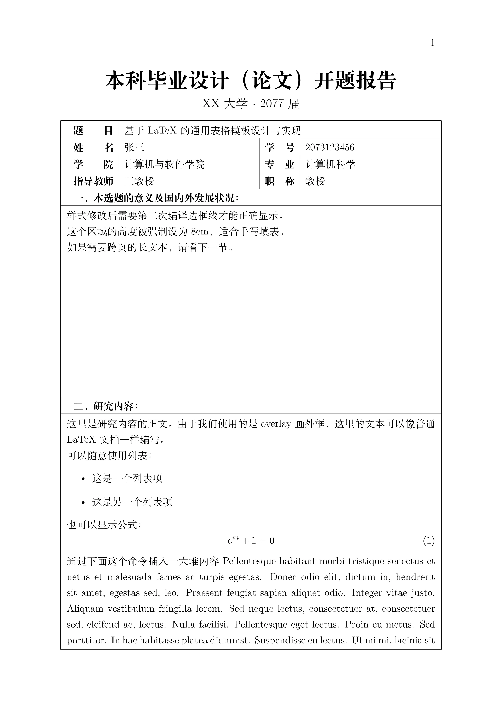

# Deans-Office-LaTeX (教务处风格文档模板)

为什么学校发的各种word模板总喜欢用一个大表格装着？

> 一个用于生成“中国高校教务处风格”文档的 LaTeX 模板。
> 满足那种全文都在一个大表格里、边框严丝合缝、首页有复杂表头但正文需要跨页的奇妙Word模板的LaTeX排版。

## `main.tex`第一页编译效果示例



## 简介

在中国高校的毕业设计开题报告、实验报告或行政表格中，经常遇到一种强制性排版要求：全文档必须看起来像在一个巨大的封闭表格中。但是LaTeX传统的 `tabular` 无法跨页，`longtable` 不支持单元格内复杂的图文混排。

本项目的核心思路是做个假的表格：
1.  视觉欺骗：利用 `TikZ` 和 `atbegshi` 在每一页生成边框，然后再插入分隔线，使其看起来就像是一个表格。
2.  流式排版：正文区域本质上是普通的文本流，可以随意分段、插入公式、列表，不再受限于表格单元格。

## 编译与使用

所有代码均包含在[`main.tex`](./main.tex)中。

仅在XeLaTeX下编译测试通过。

```bash
xelatex main.tex
```

**注意**：由于涉及到 `TikZ` 的绝对定位绘制，页面布局或内容发生更改时，通常需要**编译两次**，边框线才能显示在正确的位置。

## 核心命令说明

### 全局配置

在导言区修改以下参数，即可改变整个文档的几何结构：

```latex
\setlength{\PageMargin}{1in}  % 边框距离纸张边缘的距离
\setlength{\RowHeight}{1.2em}   % 表格行的最小高度
\def\GlobalLineWidth{0.5pt}     % 外框粗细
```

### 基础环境 (`TablePage`)

带外框的内容包裹在 `TablePage` 环境中。这个环境会在每一页创建一个包围所有内容的外框线。

```latex
\begin{TablePage}
    % 在这里写的内容会有“假表格”外框
\end{TablePage}
```

### 自定义表头 (`\PageTitle`)

生成页首处在表格外的标题。

```latex
% 语法: \PageTitle{标题内容}{标题占用高度}
\PageTitle{
  \centering \huge 本科毕业设计
}{2.5cm}
```

### 生成表格行 (`\TableRow`)

类似 `tabularx` 的语法，但会自动画好下划线并撑满版心：

```latex
% 语法: \TableRow[最小高度]{列格式}{内容...}
% X = 自动宽度, c = 居中, | = 竖线

\TableRow{ c | X | c | X }{ 
    \textbf{姓名} & 张三 & \textbf{学号} & 2023001 
}
```

### 跨页长文本 (自由流)

对于需要跨页的大段文本，直接写即可。结束后用 `\SepLine` 封口：

```latex
\TableRow{l}{\textbf{一、研究内容}} % 标题行

这里是正文...可以写很长...可以跨页...
\begin{itemize}
  \item 支持列表
  \item 支持公式 $E=mc^2$
\end{itemize}

\SepLine % 手动画一条横线结束这一块，或使用 \vspaceSepLine 增加一点垂直间距
```

### 定高文本框 (`LongTextField`)

用于模拟 Word 中那种固定高度的文本框（例如留给手写签字的区域，或者要求“本栏主要填写XX内容”）。

```
% 语法: \begin{LongTextField}[高度] ... \end{LongTextField}
% 默认高度 5cm

\begin{LongTextField}[8cm]
    这里预留了8cm的高度。
    适合打印出来后手写填写。
\end{LongTextField}
```

### 其他排版控制

- `\vspaceSepLine`: 在画分割线前后自动增加 `0.5em` 的垂直间距，比单纯的 `\SepLine` 更美观。
- `\EndTableEarly`: 提前结束表格线。如果在页面中间就需要把框封口（例如后面半页留白），请使用此命令。
- `\BlankBetweenTable{高度}`: 在表格中间“挖”一块白，造成断开的效果。

具体使用示例以及效果请查看[`main.tex`](./main.tex)文件。

## 原理

本模板使用了 `atbegshi` 宏包的钩子，在 PDF 构建阶段（Shipout）在页面层之上绘制 TikZ 图层。

- 外框：根据 `current page` 节点和 `\PageMargin` 变量计算绝对坐标矩形。
- 遮盖：`\PageTitle` 和 `\BlankBetweenTable` 本质上是画一个白色的矩形覆盖在黑色边框上，然后再画一条横线连接断开的部分，实现“开口”或“断开”的视觉效果。
- 横线：`\SepLine` 命令绘制一条宽度等于 `\textwidth` 的线，并微调左右端点以覆盖外框线宽。

## License

MIT License.

你可以随意修改此模板用于你的毕业论文、开题报告或作业。
